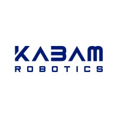

## KABAM Robotics
- *Software Engineer Intern (Indoor Robotics)* | May 24 - Nov 24
- 
- Tags: KABAM Robotics
- Badges:
  - ROS1 [black]
  - Python [green]
  - C++ [orange]
  - Docker [blue]
- List Items:
  - Maintained and enhanced the ROS1 Noetic codebase for Co-Lab, KABAM’s indoor security robot solution, using C++ and Python with Docker on Linux.
  - Developed and optimized robot movement algorithms and health monitoring features, improving system reliability for over 100 robots.
  - Diagnosed and resolved software bugs, managed bug tickets, and deployed fixes for over 100 client-deployed robots.
  - Conducted feature validation across various robot models, including regression testing for software updates and new feature implementations.

## KABAM Robotics
- *Software Engineer Intern (Outdoor Robotics)* | Nov 24 - Jan 25
- 
- Tags: KABAM Robotics
- Badges:
  - ROS1 [black]
  - Python [green]
  - C++ [orange]
  - Docker [blue]
- List Items:
  - Maintained and improved the ROS1 Noetic codebase for Halo, KABAM’s outdoor security robot solution, using C++ and Python with Docker on Linux.
  - Developed and implemented sensor debugging and self-calibration features using Rviz tools, enhancing system diagnostics.
  - Designed and optimized robot movement algorithms and health-checking features to improve performance and reliability for over 60 robots.
  - Resolved software bugs, handled client bug reports, and deployed software patches.
  - Assisted in R&D for new outdoor robotic solutions, including field testing at a dedicated test site and hardware/circuit troubleshooting.

## GovTech
- *Software Engineer Intern (Robotics)* | Jun 25 - Sep 25
- 
- Tags: GovTech
- Badges:
  - ROS2 [black]
  - Python [green]
  - Docker [blue]
  - MQTT [yellow]
- List Items:
  - Engineered and maintained fleet adapters to onboard third-party robots into OpenRMF at JTC’s Punggol Digital District, using ROS 2 Jazzy and Docker on Linux
  - Built and integrated lift adapters enabling autonomous robots to interface with lift API servers and utilise building lifts via RMF
  - Designed and optimized a centralized logging node to streamline debugging of robot and lift behaviour, leveraging ROS 2 topics, MQTT, and REST APIs

## Changi Airport Group
- *Software Engineer Intern (Robotics)* | Nov 25 - Present
- 
- Tags: Changi Airport Group
- Badges:
  - ROS2 [black]
  - Python [green]
  - Machine Learning [orange]
- List Items:
  - Robotics perception with computer vision and ROS

All tab
## Changi Airport Group
- *Software Engineer Intern (Robotics)* | Nov 25 - Present
- 
- Tags: All
- Badges:
  - ROS2 [black]
  - Python [green]
  - Machine Learning [orange]
- List Items:
  - Robotics perception with computer vision and ROS

## GovTech
- *Software Engineer Intern (Robotics)* | Jun 25 - Sep 25
- 
- Tags: All
- Badges:
  - ROS2 [black]
  - Python [green]
  - Docker [blue]
  - MQTT [yellow]
- List Items:
  - Engineered and maintained fleet adapters to onboard third-party robots into OpenRMF at JTC’s Punggol Digital District, using ROS 2 Jazzy and Docker on Linux
  - Built and integrated lift adapters enabling autonomous robots to interface with lift API servers and utilise building lifts via RMF
  - Designed and optimized a centralized logging node to streamline debugging of robot and lift behaviour, leveraging ROS 2 topics, MQTT, and REST APIs

## KABAM Robotics
- *Software Engineer Intern (Outdoor Robotics)* | Nov 24 - Jan 25
- 
- Tags: All
- Badges:
  - ROS1 [black]
  - Python [green]
  - C++ [orange]
  - Docker [blue]
- List Items:
  - Maintained and improved the ROS1 Noetic codebase for Halo, KABAM’s outdoor security robot solution, using C++ and Python with Docker on Linux.
  - Developed and implemented sensor debugging and self-calibration features using Rviz tools, enhancing system diagnostics.
  - Designed and optimized robot movement algorithms and health-checking features to improve performance and reliability for over 60 robots.
  - Resolved software bugs, handled client bug reports, and deployed software patches.
  - Assisted in R&D for new outdoor robotic solutions, including field testing at a dedicated test site and hardware/circuit troubleshooting.

## KABAM Robotics
- *Software Engineer Intern (Indoor Robotics)* | May 24 - Nov 24
- 
- Tags: All
- Badges:
  - ROS1 [black]
  - Python [green]
  - C++ [orange]
  - Docker [blue]
- List Items:
  - Maintained and enhanced the ROS1 Noetic codebase for Co-Lab, KABAM’s indoor security robot solution, using C++ and Python with Docker on Linux.
  - Developed and optimized robot movement algorithms and health monitoring features, improving system reliability for over 100 robots.
  - Diagnosed and resolved software bugs, managed bug tickets, and deployed fixes for over 100 client-deployed robots.
  - Conducted feature validation across various robot models, including regression testing for software updates and new feature implementations.