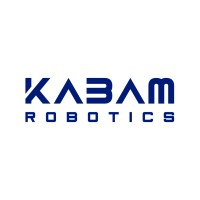

## KABAM Robotics
- *Robotics Software Engineer Intern (Indoor Team)* | May 24 - Nov 24
- 
- Tags: KABAM Robotics
- Badges:
  - ROS1 [black]
  - Python [green]
  - C++ [orange]
  - Docker [blue]
- List Items:
  - Maintained and enhanced the ROS1 Noetic codebase for Co-Lab, KABAM’s indoor security robot solution, using C++ and Python with Docker on Linux.
  - Developed and optimized robot movement algorithms and health monitoring features, improving system reliability for over 100 robots.
  - Diagnosed and resolved software bugs, managed bug tickets, and deployed fixes for over 100 client-deployed robots.
  - Conducted feature validation across various robot models, including regression testing for software updates and new feature implementations.

## KABAM Robotics
- *Robotics Software Engineer Intern (Outdoor Team)* | Nov 24 - Jan 25
- 
- Tags: KABAM Robotics
- Badges:
  - ROS1 [black]
  - Python [green]
  - C++ [orange]
  - Docker [blue]
- List Items:
  - Maintained and improved the ROS1 Noetic codebase for Halo, KABAM’s outdoor security robot solution, using C++ and Python with Docker on Linux.
  - Developed and implemented sensor debugging and self-calibration features using Rviz tools, enhancing system diagnostics.
  - Designed and optimized robot movement algorithms and health-checking features to improve performance and reliability for over 60 robots.
  - Resolved software bugs, handled client bug reports, and deployed software patches.
  - Assisted in R&D for new outdoor robotic solutions, including field testing at a dedicated test site and hardware/circuit troubleshooting.

## ## Government Technology (GovTech)
- *Robotics Software Engineer Intern* | Jun 25 - Sep 25
- 
- Tags: GovTech
- Badges:
  - ROS2 [black]
  - Python [green]
  - Docker [blue]
  - MQTT [yellow]
- List Items:
  - Engineered and maintained fleet adapters to onboard third-party robots into OpenRMF at JTC’s Punggol Digital District, using ROS 2 Jazzy and Docker on Linux
  - Built and integrated lift adapters enabling autonomous robots to interface with lift API servers and utilise building lifts via RMF
  - Designed and optimized a centralized logging node to streamline debugging of robot and lift behaviour, leveraging ROS 2 topics, MQTT, and REST APIs

## Changi Airport Group (CAG)
- *Robotics Software Engineer Intern* | Nov 25 - Mar 26
- 
- Tags: CAG
- Badges:
  - ROS2 [black]
  - Python [green]
  - Machine Learning [orange]
- List Items:
  - Developed robotics perception systems using computer vision models (e.g. YOLO) and RGB-D cameras for real-time environment understanding.
  - Integrated perception modules with ROS 1/2 robotics stacks by building custom ROS nodes, messaging pipelines, and sensor interfaces.

## Defence Science and Technology Agency (DSTA)
- *AI Embodied Robotics Software Engineer* | July 26 - Present
- 
- Tags: DSTA
- Badges:
  - ROS2 [black]
  - Python [green]
  - C++ [red]
  - Machine Learning [orange]
  - Docker [blue]
- List Items:
  - Robotics

All tab
## Defence Science and Technology Agency (DSTA)
- *AI Embodied Robotics Software Engineer* | July 26 - Present
- 
- Tags: All
- Badges:
  - ROS2 [black]
  - Python [green]
  - C++ [red]
  - Machine Learning [orange]
  - Docker [blue]
- List Items:
  - Robotics

## Changi Airport Group (CAG)
- *Robotics Software Engineer Intern* | Nov 25 - Mar 26
- 
- Tags: All
- Badges:
  - ROS2 [black]
  - Python [green]
  - Machine Learning [orange]
- List Items:
  - Developed robotics perception systems using computer vision models (e.g. YOLO) and RGB-D cameras for real-time environment understanding.
  - Integrated perception modules with ROS 1/2 robotics stacks by building custom ROS nodes, messaging pipelines, and sensor interfaces.

## Government Technology (GovTech)
- *Robotics Software Engineer Intern* | Jun 25 - Sep 25
- 
- Tags: All
- Badges:
  - ROS2 [black]
  - Python [green]
  - Docker [blue]
  - MQTT [yellow]
- List Items:
  - Engineered and maintained fleet adapters to onboard third-party robots into OpenRMF at JTC’s Punggol Digital District, using ROS 2 Jazzy and Docker on Linux
  - Built and integrated lift adapters enabling autonomous robots to interface with lift API servers and utilise building lifts via RMF
  - Designed and optimized a centralized logging node to streamline debugging of robot and lift behaviour, leveraging ROS 2 topics, MQTT, and REST APIs

## KABAM Robotics
- *Robotics Software Engineer (Outdoor Team)* | Nov 24 - Jan 25
- 
- Tags: All
- Badges:
  - ROS1 [black]
  - Python [green]
  - C++ [orange]
  - Docker [blue]
- List Items:
  - Maintained and improved the ROS1 Noetic codebase for Halo, KABAM’s outdoor security robot solution, using C++ and Python with Docker on Linux.
  - Developed and implemented sensor debugging and self-calibration features using Rviz tools, enhancing system diagnostics.
  - Designed and optimized robot movement algorithms and health-checking features to improve performance and reliability for over 60 robots.
  - Resolved software bugs, handled client bug reports, and deployed software patches.
  - Assisted in R&D for new outdoor robotic solutions, including field testing at a dedicated test site and hardware/circuit troubleshooting.

## KABAM Robotics
- *Robotics Software Engineer Intern (Indoor Team)* | May 24 - Nov 24
- 
- Tags: All
- Badges:
  - ROS1 [black]
  - Python [green]
  - C++ [orange]
  - Docker [blue]
- List Items:
  - Maintained and enhanced the ROS1 Noetic codebase for Co-Lab, KABAM’s indoor security robot solution, using C++ and Python with Docker on Linux.
  - Developed and optimized robot movement algorithms and health monitoring features, improving system reliability for over 100 robots.
  - Diagnosed and resolved software bugs, managed bug tickets, and deployed fixes for over 100 client-deployed robots.
  - Conducted feature validation across various robot models, including regression testing for software updates and new feature implementations.
