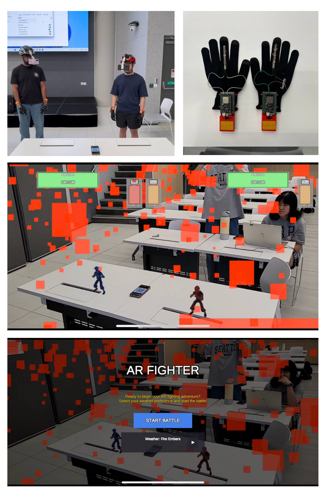
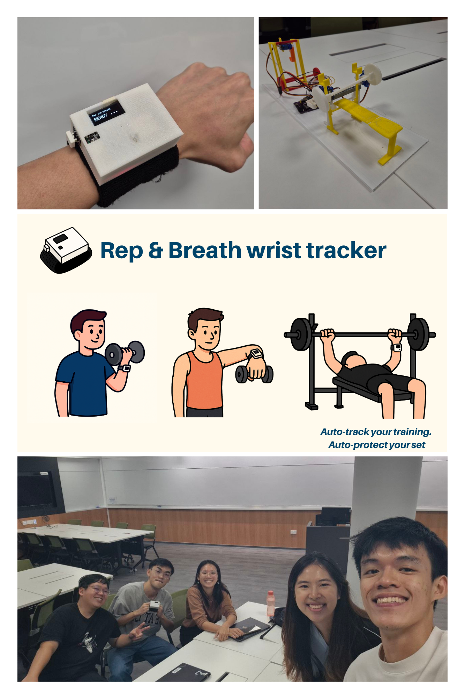
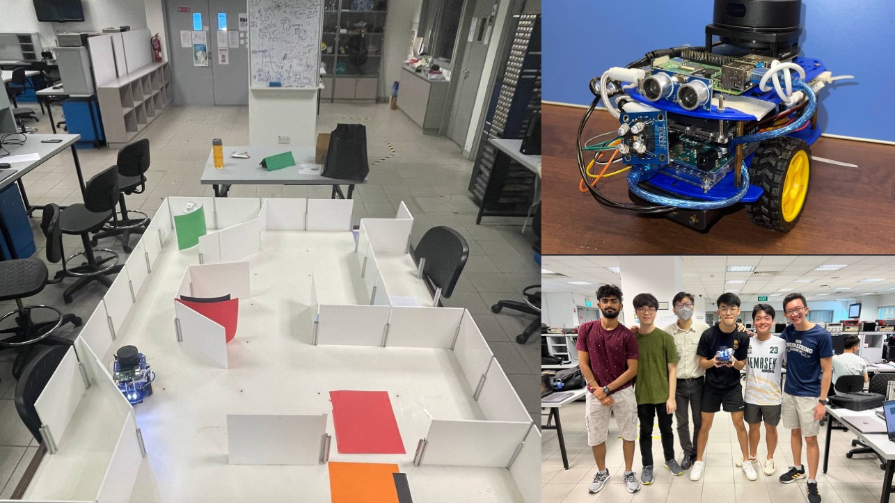

## CG4002, Computer Engineering Capstone Project
Computer Engineering Capstone Project Augmented Reality (AR) Street-Fighter-Style Game with Wearable Sensing and On-Device Machine Learning Acceleration Our project focuses on the end-to-end development of an interactive Augmented Reality (AR) game inspired by the iconic Street Fighter franchise. The system combines wearable sensing, machine learning–based action recognition, and FPGA-accelerated inference to enable real-time gesture-controlled combat in AR. We designed a custom smart glove equipped with an IMU and flex sensor that captures the player’s hand and arm movements. These sensor streams are fed into a Temporal Convolutional Network (TCN) that classifies specific combat actions such as punches, uppercuts, and palm strikes with high temporal precision. To achieve ultra-low-latency inference suitable for rapid gameplay, we deployed the TCN onto a Zynq Ultrascale+ SoC, leveraging its FPGA fabric as an AI accelerator. Using Vitis HLS and Vivado, our team converted the model from software into synthesizable RTL, integrated custom AXI-Stream data paths, and built a hardware–software co-design pipeline for high-throughput execution. This provides deterministic, high-speed inference directly on the edge device without reliance on cloud compute. On the front end, we developed a mobile AR interface that overlays virtual combat effects fireballs, hits, particle effects—based on the classifier’s output. This creates an immersive, responsive AR fighting experience controlled entirely through natural hand gestures.
- 
- Tags: CG4002
- Badges:
  - MQTT [blue]
  - Machine Learning [cyan]
  - Python [green]
  - C++ [orange]
  - Hardware Sensors [teal]
  - ESP32 [red]
  - AMD ZYNQ [purple]
- Buttons:
  - Link [https://example.com]

## CS3237, Introduction to Internet of Things
Our project leverages machine learning and a custom-built wrist tracker powered by an ESP32 and IMU sensors. The device streams real-time motion data over MQTT to classify exercise actions and count repetitions with high accuracy. This end-to-end system showcases embedded sensing, wireless communication, and on-device intelligence working seamlessly together.
- 
- Tags: CS3237
- Badges:
  - MQTT [blue]
  - Machine Learning [cyan]
  - Python [green]
  - Hardware Sensors [teal]
  - ESP32 [red]
- Buttons:
  - Link [https://example.com]

## CG2111A, Engineering Principles and Practice II
In CG2111A, my team and I handled a larger-scale systems and designed a more complex computer engineering system that could process more information and handle more real-world interfacing. Our robot would emulate the functionalities of a search-and-rescue robot through the use of a Lidar sensor to map its environment, a Raspberry Pi to engage in serial communication with our Arduino Uno and other components such as ultrasonic sensors, colour readers and motors to complete this search and rescue mission.
- 
- Tags: CG2111A
- Badges:
- Buttons:

## CG1111A, Engineering Principles and Practice I
Through CG1111A, my teammates and I completed a project on building a mBot that could navigate a maze and make turns according to the colour it reads through a built-on colour sensor we made. An ultrasonic sensor was also added in to ensure that the mBot could move in a straight line and keep a constant distance away from the side walls.
- 
- Tags: CG1111A
- Badges:
- Buttons: