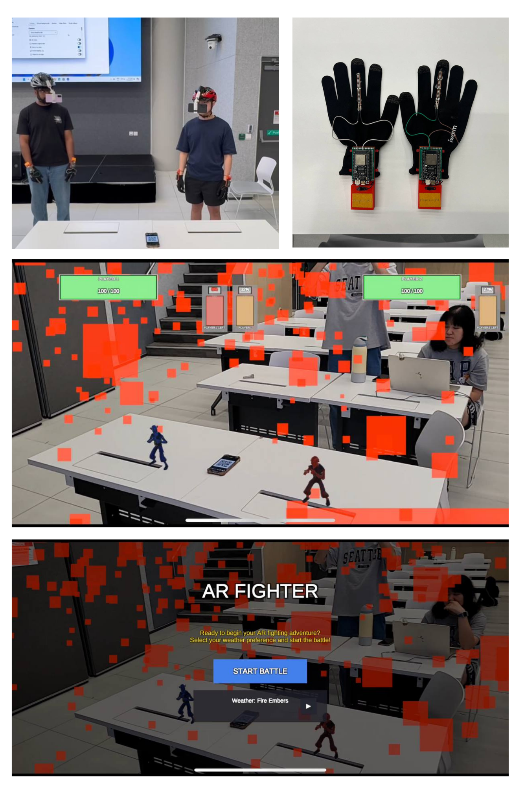
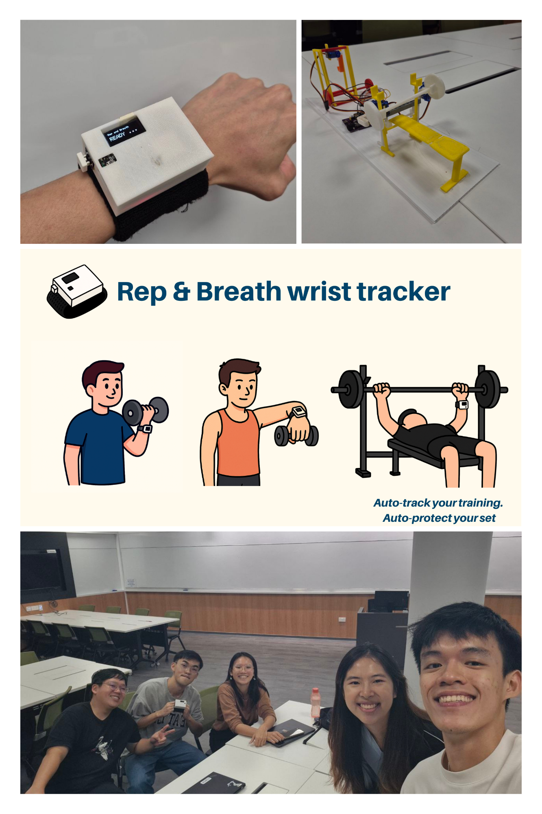
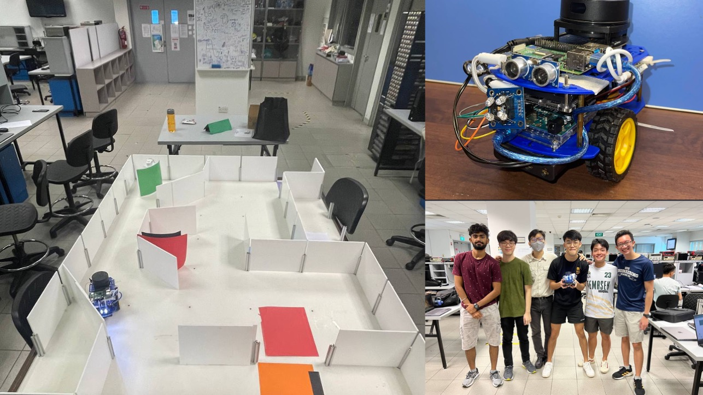
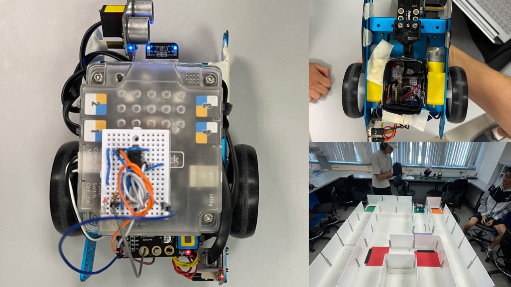
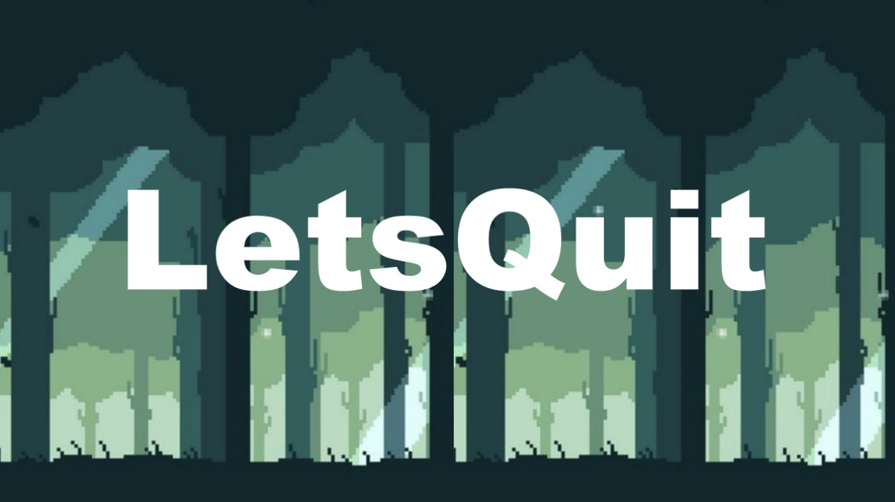

## CG4002, Computer Engineering Capstone Project
Developed a gesture-controlled AR fighting game using a custom smart glove with IMU and flex sensors. A Temporal Convolutional Network classified combat gestures in real time, with inference accelerated on a Zynq UltraScale+ FPGA using Vitis HLS and Vivado for responsive, on-device gameplay.
- 
- Tags: CG4002
- Badges:
  - MQTT [blue]
  - Machine Learning [cyan]
  - Python [green]
  - C++ [orange]
  - Hardware Sensors [teal]
  - ESP32 [red]
  - AMD ZYNQ [purple]
- Buttons:
  - Link [https://example.com]

## CS3237, Introduction to Internet of Things
Our project leverages machine learning and a custom-built wrist tracker powered by an ESP32 and IMU sensors. The device streams real-time motion data over MQTT to classify exercise actions and count repetitions with high accuracy. This end-to-end system showcases embedded sensing, wireless communication, and on-device intelligence working seamlessly together.
- 
- Tags: CS3237
- Badges:
  - MQTT [blue]
  - Machine Learning [cyan]
  - Python [green]
  - Hardware Sensors [teal]
  - ESP32 [red]
- Buttons:
  - Link [https://example.com]

## CG2111A, Engineering Principles and Practice II
In CG2111A, my team and I handled a larger-scale systems and designed a more complex computer engineering system that could process more information and handle more real-world interfacing. Our robot would emulate the functionalities of a search-and-rescue robot through the use of a Lidar sensor to map its environment, a Raspberry Pi to engage in serial communication with our Arduino Uno and other components such as ultrasonic sensors, colour readers and motors to complete this search and rescue mission.
- 
- Tags: CG2111A
- Badges:
- Buttons:

## CG1111A, Engineering Principles and Practice I
Through CG1111A, my teammates and I completed a project on building a mBot that could navigate a maze and make turns according to the colour it reads through a built-on colour sensor we made. An ultrasonic sensor was also added in to ensure that the mBot could move in a straight line and keep a constant distance away from the side walls.
- 
- Tags: CG1111A
- Badges:
- Buttons:

## CP2106, Independent Software Development Project
LetsQuit is a platform created to help keen Quitters overcome their addictions. Through gamified features, streak trackers and an online support group, LetsQuit aims to captivate users, motivate them and help them proactively abstain from their addictions.
- 
- Tags: LetsQuit
- Badges:
  - React [blue]
  - HTML [orange]
  - Javascript [yellow]
- Buttons:
  - Link [https://letsquit-1b913.web.app]
